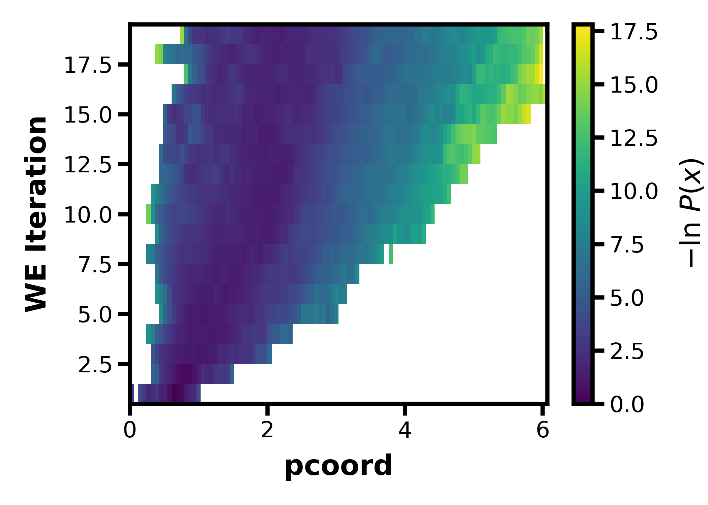

wedap
===========================

[](https://badge.fury.io/py/wedap)
[](https://pepy.tech/project/wedap)
[](https://github.com/darianyang/wedap/blob/master/LICENSE)

weighted ensemble data analysis and plotting (wedap)

This is used to plot H5 files produced from running [WESTPA](https://github.com/westpa/westpa).

This repository is currently under development.

### Requirements

- Numpy
- Matplotlib
- H5py
- Moviepy
- Scipy
- tqdm
- Gooey (optional for GUI)

## GUI

wedap has a GUI built using [Gooey](https://github.com/chriskiehl/Gooey) which can be launched by running `wedap` or `python wedap` if you're in the main wedap directory of this repository. If you're using MacOSX, you'll need to run `pythonw wedap` in the main directory since conda prevents wxPython from accessing the display on Mac. 
If you pip install (instead of conda installing) wxPython and Gooey on Mac you may be able to just run `wedap`. 
If you wish to use the command line interface instead include any amount of arguments and include `-h` or `--help` to see the available options.

For MacOSX, you can set up an alias in your `.bash_profile` by running the following:
```
echo "alias wedap=pythonw /Path/to/wedap/git/repo/wedap/wedap" >> ~/.bash_profile
```
Then simply type `wedap` on the terminal to run the wedap GUI.

## Installation

Install into a new conda env:
``` bash
conda env create --name wedap python=3.7+
conda activate wedap
conda install -c conda-forge gooey
pip install wedap
```
Or update an existing environmnent:
``` bash
conda activate ENV_NAME
conda install -c conda-forge gooey
pip install wedap
```
Or, if you have the repository cloned, go into the main wedap directory (may have more up to date features):
``` bash
conda install -c conda-forge gooey
pip install .
```
If you don't need the GUI, then installing gooey is not required

Note that gooey is kindof troublesome to pip install in some systems, which is also why it's not included in the requirements (although it is required for the GUI). I am trying to fix this but for now I reccomend conda installing gooey.

## Examples

After installation, to run the CLI version and view available options:
``` bash
wedap --help
```
Or:
``` bash
wedap -h
```
To start the GUI simply input:
``` bash
wedap
```
To start the GUI on MacOSX:
``` bash
pythonw /Path/to/wedap/git/repo/wedap/wedap
```
To visualize the evolution of the pcoord for the example p53.h5 file via CLI:
``` bash
wedap -h5 wedap/data/p53.h5
```
To do the same with the API:
``` Python
import wedap
import matplotlib.pyplot as plt

wedap.H5_Plot(h5="wedap/data/p53.h5", data_type="evolution").plot()
plt.show()
```
The resulting `p53.h5` file evolution plot will look like this:
<p align="left">
    
</p>

See the examples directory for more realistic applications using the Python API.

## Contributing

Features should be developed on branches. To create and switch to a branch, use the command:

`git checkout -b new_branch_name`

To switch to an existing branch, use:

`git checkout branch_name`

To submit your feature to be incorporated into the main branch, you should submit a `Pull Request`. The repository maintainers will review your pull request before accepting your changes.

## Copyright

Copyright (c) 2021, Darian Yang
