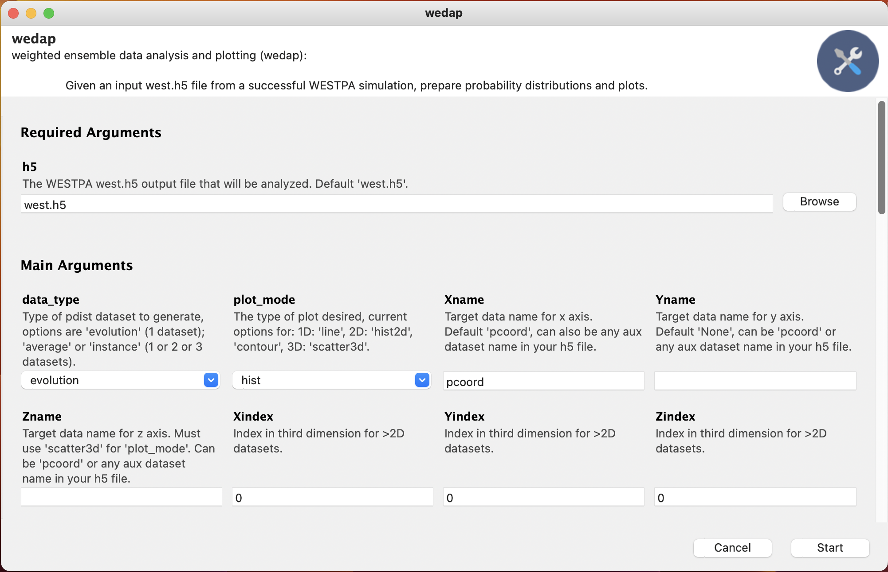

# Summary

Biomolecules such as proteins, lipids, and nucleic acids are highly dynamic with multiple interacting partners. Molecular dynamics (MD) simulations are a useful tool for studying these interactions and movements by treating atoms and bonds as balls and springs; the movement of which can then be approximated using Newton’s laws of motion. It turns out that even with this approximation, MD simulations work well and can accurately capture small timescale dynamics for a variety of biomolecular systems [@Karplus1990]. Due to computational limitations, routine MD simulations typically only capture up to the µs or low ms timescale. However, some of the most interesting biological phenomena can take seconds or hours to occur [@Zweir2010]. To reach these longer timescales, a number of enhanced sampling strategies have been developed, including the weighted ensemble (WE) strategy [@Huber1996; @Zuckerman2017]. 

Compared to a standard MD simulation where the output is a single trajectory, the output from WE consists of multiple short trajectories that have an associated weight, which changes when the ensemble of trajectories are resampled at every iteration of the algorithm. The increased complexity of WE output makes standard analysis and plotting tools difficult to use since the changing weights must be accounted for during analysis and visualization steps. `wedap` is a Python package for simplifying weighted ensemble data analysis and plotting through a user-friendly command line interface, graphical user interface, and Python API to serve multiple levels of end-users.

# Statement of need

Currently, the most cited software package for running WE simulations is the Weighted Ensemble Simulation Toolkit with Parallelization and Analysis (WESTPA) [@Zweir2015; @Russo2022]. The WESTPA community is large and has had continued success using WE and WESTPA with many previous and ongoing projects [@Sztain2021; @Saglam2019; @Zuckerman2017], a more comprehensive and continuously updated list of which can be found at https://westpa.github.io/westpa/publications.html. WE simulation data from WESTPA contains an ensemble of many short trajectories that vary in number and weight between each iteration. To address the complexity of analyzing WE data, WESTPA contains tools for generating and plotting probability distributions, among other analysis tools. While the native WESTPA-based plotting tools are functional, they have limitations that spurred motivation for the genesis of `wedap`. The WESTPA plotting tools are currently only accessible as command line programs, and require two separate tools to generate a final figure from the output WESTPA dataset. This workflow is relatively straightforward for simple plotting examples, but quickly becomes complicated for more intricate plots, such as when using data other than the main progress coordinate dataset chosen for the WESTPA run. For both generating probability distributions of auxiliary datasets that are a part of the WESTPA output file and for advanced formatting of the plot, a separate Python script must be included for each WESTPA-based command. This complexity in analysis can be especially difficult for new users of WESTPA to analyze their output datasets beyond simple distributions. For advanced users, the WESTPA-based commands and their respective input Python files are often controlled using command line scripting, potentially leading to many intermediate files as you check the progress of a WESTPA simulation for numerous auxiliary datasets. Although the WESTPA plotting programs are written in Python, they currently do not have an easily accessible API to access the plot objects created.

In order to address these limitations, we designed `wedap` to provide a single, streamlined program for generating probability distributions and plots from WESTPA output datasets without the need for additional Python files. `wedap` is available through a command line program, a graphical user interface (GUI) using Gooey [@Gooey] and wxPython [@wxPython] (\autoref{fig:gui}), or directly through the Python application programming interface (API) by importing `wedap`. This multimodality is useful for addressing a wider range of end-user skill sets; for users that may be new to programming, the GUI requires much less computational background and can be accessed from the command line by typing `wedap` without any other arguments, the command line program allows for stream-lined and convenient analysis that accommodates a wide range of users, for advanced users who prefer to have everything within Python, the Python API provides appropriate classes to generate both probability distribution data (`wedap.H5_Pdist`) and plot objects (`wedap.H5_Plot`), which can then be expanded on if needed. The `wedap` Python API is especially flexible, allowing for easy incorporation into existing Python workflows and interfacing with other Python packages. For example, the API can be used to make multi-panel figures or for plotting multiple datasets onto a single axis, and opens up the figure making process to the full functionality of Python. All plotting methods in `wedap` are all implemented using Matplotlib [@Hunter:2007], and the plot objects or probability distribution arrays are easily accessible as attributes of the plot object, allowing easy interfacing with other plotting packages such as seaborn [@Waskom2021]. All analysis operations in `wedap` are carried out using NumPy [@harris2022array] for optimal memory usage and performance. H5py [@h5py] was used to access and process the HDF5 files that are output from WESTPA.

Various examples of both basic and advanced Python scripts are available in the `wedap` documentation and the github repository for guidance on general usage, as well examples for interfacing with other Python packages such as gif [@gif] for creating animated plots or scikit-learn [@scikit-learn] for accessing WE data as input to machine learning workflows. While we first implemented `wedap` strictly for generating probability distributions and plots, many additional features have been implemented and ongoing development is expected to continue. Additional features include being able to plot traces of individual pathways, plotting and adding a separately generated dataset seamlessly into the distributions from the WESTPA output file, plotting probability distributions without specific basis states, and helper functions to extract raw data arrays and weights from the output for easy pipelining to other functions. Overall, `wedap` is designed to provide a more accessible WE data analysis and plotting tool to the WESTPA simulation community with modularity that allows for flexibility of use and easy feature development. We note that `wedap` is already currently used by different researchers and groups in the WE community and we expect to continue maintenance and development of expanded `wedap` features for the foreseeable future in parallel with the WESTPA software package.

# Acknowledgements

We would like to thank everyone in the Chong lab for helpful discussions, testing out `wedap` even in the early stages, and providing helpful feedback and suggestions. Feedback and discussions with early users Jeremy Leung, Riccardo Solazzo, Anthony Bogetti, Marion Silvestrini, Rhea Abraham, and Hannah Piston were especially helpful. We would also like to thank WESTPA developers for helpful feedback. D.T.Y. was supported by a National Institutes of Health (NIH) Pittsburgh Aids Research Training (PART) program training grant T32AI065380 and a University of Pittsburgh Andrew Mellon Fellowship.

# References

